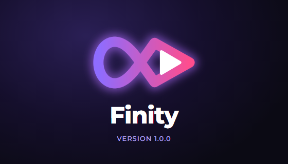
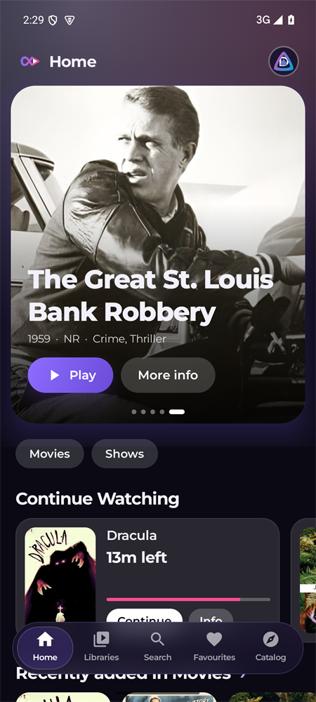
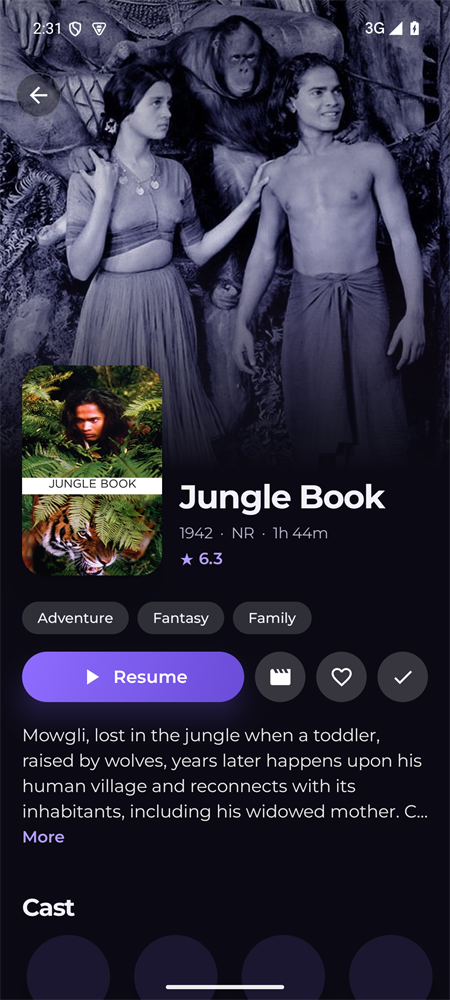
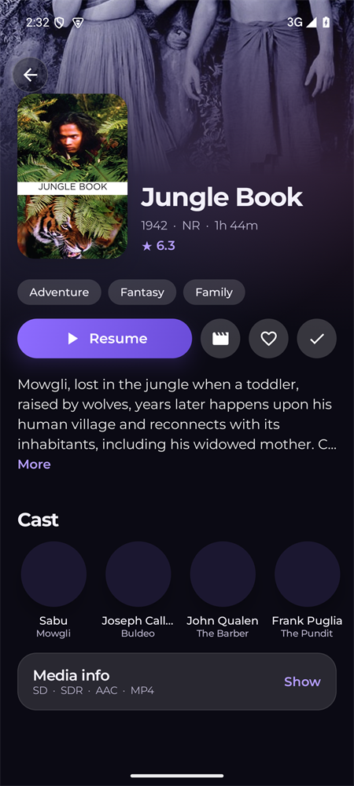

  

<h3 align="center">A Jellyfin client that feels like the streaming apps you already love.</h3>

  Native on Windows and Android, with a proper video player (libmpv) inside. 
  Smooth, calm and built around playback.

  <a href="../../releases/latest"><b>Download the latest release</b></a>

---

## Download

| | |
| --- | --- |
| **Windows 10 / 11 (64-bit)** | `Finity-Setup-*.exe` (installs for your user, no administrator rights) |
| **Android 8.0 or newer** | `Finity-Android-*.apk` |
| **Android TV** | coming soon |

Both are on the **[Releases](../../releases/latest)** page. You need a Jellyfin server (10.9 or newer is best). Finity does not host or provide any media, and is not affiliated with the Jellyfin project.

> **First run on Windows:** Windows may say "Windows protected your PC" because the installer is not signed yet. Choose **More info → Run anyway**.
> **Android:** open the APK and allow installs from your browser or files app when asked.

## On your phone

  
  &nbsp;&nbsp;
  
  &nbsp;&nbsp;
  

## What you get

**A player that plays everything**
- Almost any video, audio and subtitle format, including **PGS and styled ASS subtitles**. The server is asked first, so Direct Play is used whenever it can be.
- **Smart Fit** removes black bars baked into a video, only when that really makes the picture bigger.
- Audio and subtitle picker with the language shown, subtitle timing, speed and streaming quality.
- Seek-bar previews with chapters and thumbnails, Skip Intro, **Up Next** with auto-play, Previous / Next episode.
- Resumes where you stopped, remembers your tracks per show, shows an age-rating notice at the start like the big streamers.
- Picture-in-picture, and a mini player on Windows.

**Browse in style**
- Home with a rotating banner, Continue Watching and Latest rows; Libraries, Search with filters, and Favourites.
- **Discover** through Jellyseerr: browse what is popular and request what your server does not have. Sign in with your Jellyfin account.
- Details with cast, episodes, seasons, media info and trailers. Watch history and stats, several profiles and servers.
- Windows: right-click a poster to **Mark as watched**, favourite it or open its details.

**Made to feel good**
- Smooth animations, a violet look, and a soft glow taken from the artwork on screen.
- Windows: Low Performance Mode, Discord status, Stats for Nerds, and an installer with its own opening animation.
- Android: a glass navigation bar, swipe for brightness and volume, double-tap to skip.

**For server owners (Pro)** &nbsp;Server admin shows who is watching right now, a readable activity log, library tools, and restart or shut down for your server.

## Support Finity

Finity is made by one person, in the evenings. Everything for watching, browsing and requesting is free, for everyone, for good.
If it makes your movie nights nicer, open **Settings → Send Support** inside the app:

- **5 dollars or more:** a ★ Supporter badge, plus colour themes and fonts on Android.
- **10 dollars or more:** unlocks **Pro** (Server admin) for good.

## Privacy

Your password only goes to your own Jellyfin (and, if you use Discover, your own Jellyseerr) server. Finity has no accounts and no tracking.
The only thing it fetches from the internet on its own is [`supporters.json`](supporters.json), a small list the app reads to know who has a badge or Pro.

## About this repository

This repository only holds the downloads and that one file. The app's source code is private. Built with libmpv (LGPL), WinUI 3, Jetpack Compose, Montserrat and Inter (SIL Open Font License).
