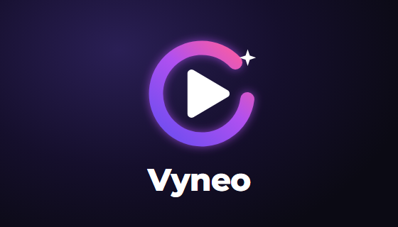
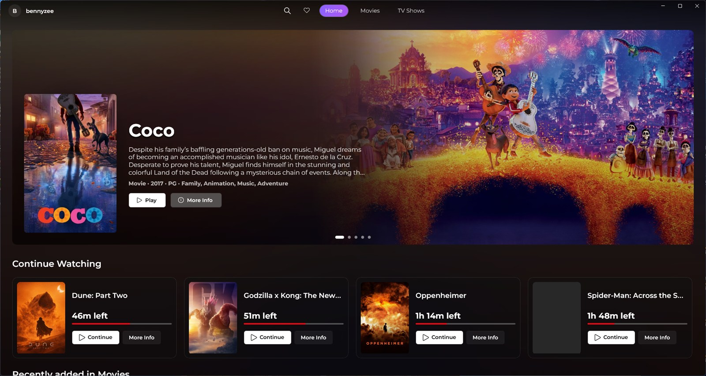
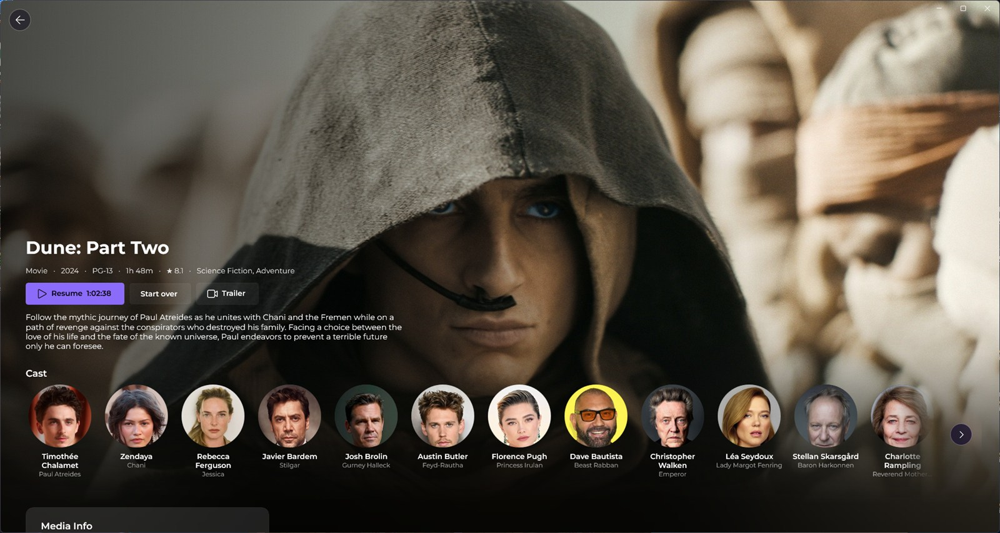
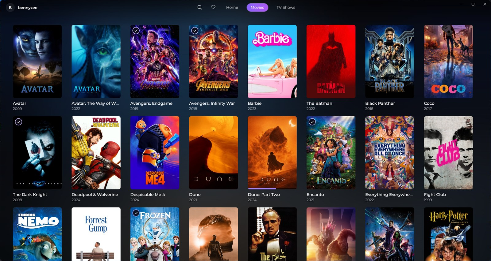
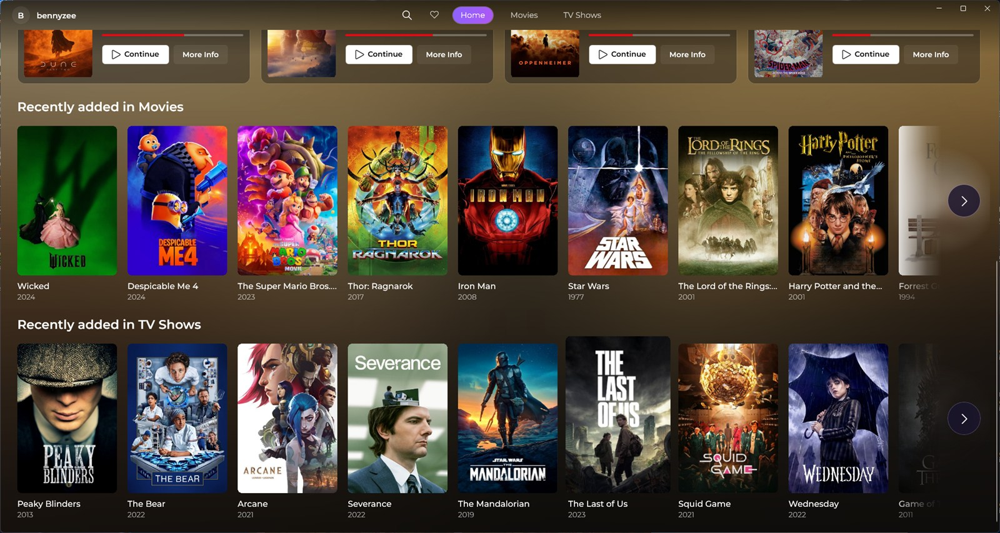
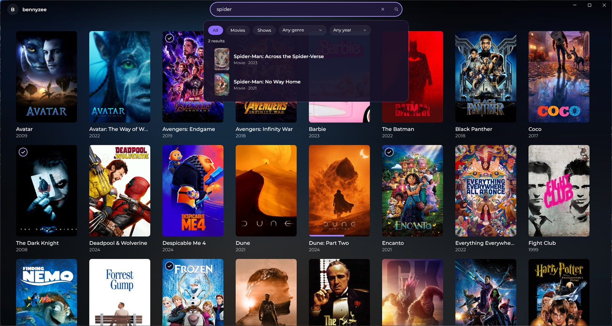
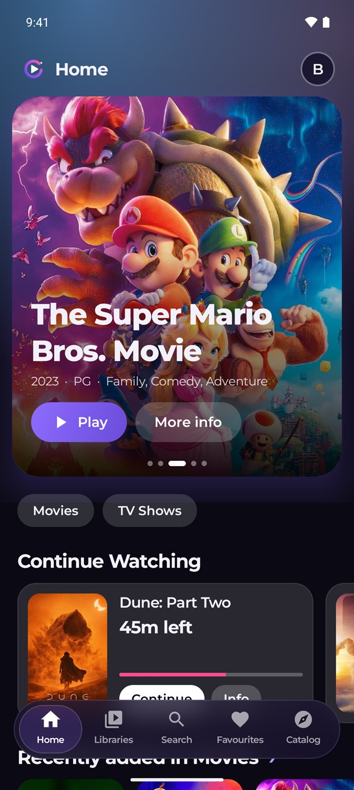
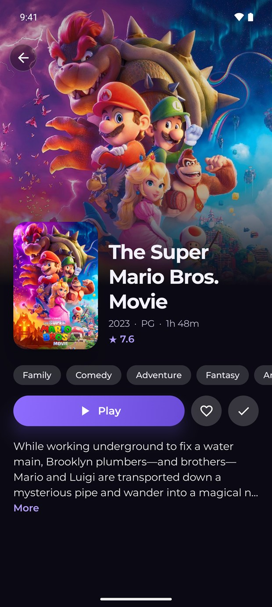
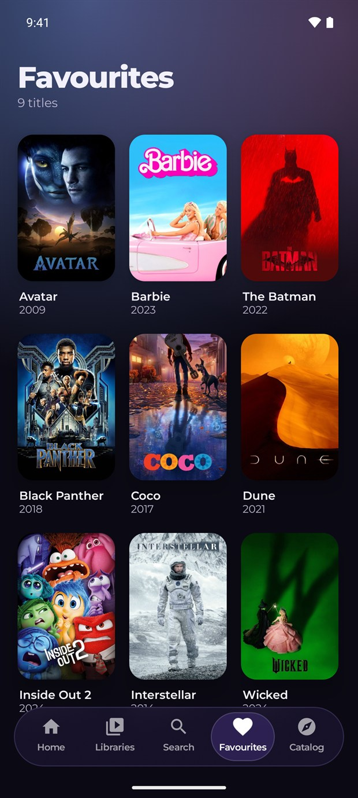

  

<h1 align="center">Vyneo</h1>

  <b>A Jellyfin client for Windows and Android that feels like the streaming apps you already love.</b> 
  A proper video player (libmpv) inside a smooth, calm interface.

  
  &nbsp;
  

  
  
  
  
  

  <a href="#download">Download</a> ·
  <a href="#screenshots">Screenshots</a> ·
  <a href="#features">Features</a> ·
  <a href="#faq">FAQ</a> ·
  <a href="#support-vyneo">Support</a> ·
  <a href="#privacy">Privacy</a>

---

## Download

| | | |
| --- | --- | --- |
| 🪟 **Windows 10 / 11** (64-bit) | `Vyneo-Setup-*.exe` | Installs for your user only, no administrator rights |
| 🤖 **Android 8.0 or newer** | `Vyneo-Android-*.apk` | Phones and tablets |
| 📺 **Android TV** | coming soon | A full redesign for the big screen is in the works |

Both files are on the **[Releases](../../releases/latest)** page. You need a Jellyfin server (10.9 or newer is best). Vyneo does not host or provide any media, and is not affiliated with the Jellyfin project.

> **Windows says "Windows protected your PC"?** The installer is not signed yet. Choose **More info → Run anyway**.
>
> **Android:** open the APK and allow installs from your browser or files app when asked.
>
> **Updating:** run the new installer. It finds your installed Vyneo and offers to update it, reinstall or uninstall. Windows can also check by itself under *Settings → About → Check for updates*.

## Screenshots

### On Windows

  

  
  

  
  

### On your phone

  
  &nbsp;&nbsp;
  
  &nbsp;&nbsp;
  

Screenshots use a demo library; posters and artwork belong to their respective owners.

## Features

<table>
<tr>
<td width="50%" valign="top">

### 🎬 A player that plays everything
- Almost any video, audio and subtitle format, including **PGS and styled ASS subtitles**
- The server is asked first, so **Direct Play** is used whenever it can be
- **Smart Fit** removes black bars baked into a video, only when that really makes the picture bigger
- Audio and subtitle picker with the language shown, subtitle timing, speed and streaming quality
- **Seek-bar previews**, **Skip Intro**, **Up Next** with auto-play, Previous / Next episode
- Resumes where you stopped, remembers your tracks per show
- Picture-in-picture, and a mini player on Windows

</td>
<td width="50%" valign="top">

### ✨ Browse in style
- Home with a rotating banner, Continue Watching and Latest rows
- Libraries, **Search** with filters and recently opened titles, **Favourites**
- **Discover** through Jellyseerr: browse what is popular and request what your server does not have, signing in with your Jellyfin account
- Details with cast, episodes, seasons, media info and trailers
- Watch history and stats, several profiles and servers, home and remote addresses
- Windows: right-click a poster to mark it watched or favourite it

</td>
</tr>
<tr>
<td width="50%" valign="top">

### 🎨 Made to feel good
- Smooth animations, a violet look, and a soft glow taken from the artwork on screen
- **Windows:** Low Performance Mode, Discord status, Stats for Nerds, and an installer with its own opening animation
- **Android:** a glass navigation bar, swipe for brightness and volume, double-tap to skip, and a battery-saver mode that drops the heavy effects when the phone runs warm

</td>
<td width="50%" valign="top">

### 🛠️ For server owners (Pro)
**Server admin** shows who is watching right now, a readable activity log (who played what, when, and who actually finished it), library tools, and restart or shut down for your server.

</td>
</tr>
</table>

## FAQ

<b>Does Vyneo come with movies or shows?</b>

 
No. Vyneo is only a player for <i>your own</i> Jellyfin server. It does not host, provide or link to any media.

<b>Which Jellyfin version do I need?</b>

 
10.9 or newer works; Skip Intro needs 10.10 or newer, and seek-bar thumbnails need trickplay turned on in your server.

<b>Is it free?</b>

 
Yes. Everything for watching, browsing and requesting is free, for everyone, for good. Only the Server admin tools are <b>Pro</b>.

<b>Why does Windows warn me when I install it?</b>

 
The installer is not code-signed yet, which is a paid certificate. Choose <i>More info → Run anyway</i>. The installer is plain and only installs for your own user.

<b>Will it work on my Android TV?</b>

 
Not yet. The phone and tablet app is ready; a full redesign for the TV is in the works.

<b>Where is the source code?</b>

 
The source is private for now. This repository holds the downloads and release notes.

## Support Vyneo

Vyneo is made by one person, in the evenings. Everything for watching, browsing and requesting is free, for everyone, for good.
If it makes your movie nights nicer, open **Settings → Send Support** inside the app:

- **5 dollars or more:** a ★ Supporter badge, plus colour themes and fonts on Android
- **10 dollars or more:** unlocks **Pro** (Server admin) for good

## Privacy

Your password only goes to your own Jellyfin (and, if you use Discover, your own Jellyseerr) server. Vyneo has no accounts and no tracking.
The only things it fetches from the internet on its own are [`supporters.json`](supporters.json), a small list the app reads to know who has a badge or Pro, and (on Windows) the release list to check for updates.

## About this repository

This repository only holds the downloads and that one file. The app's source code is private. Built with libmpv (LGPL), WinUI 3, Jetpack Compose, Montserrat and Inter (SIL Open Font License).

Vyneo, a Jellyfin client for Windows and Android (formerly Finity). Jellyfin app for Windows, Jellyfin app for Android, Jellyfin player, libmpv.
